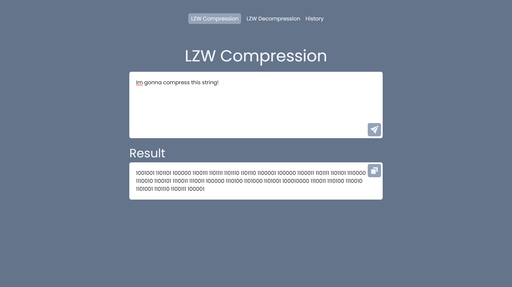
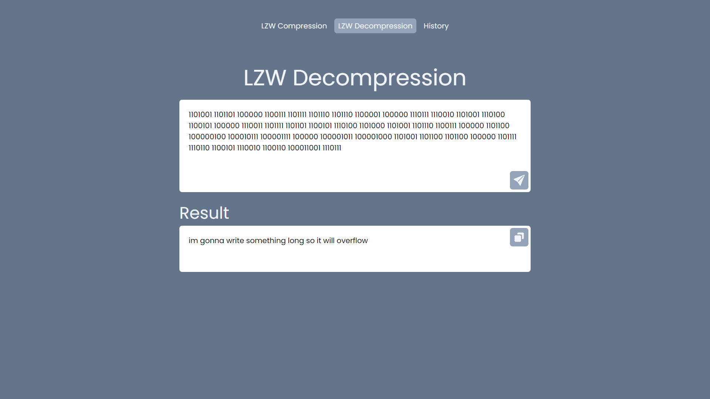
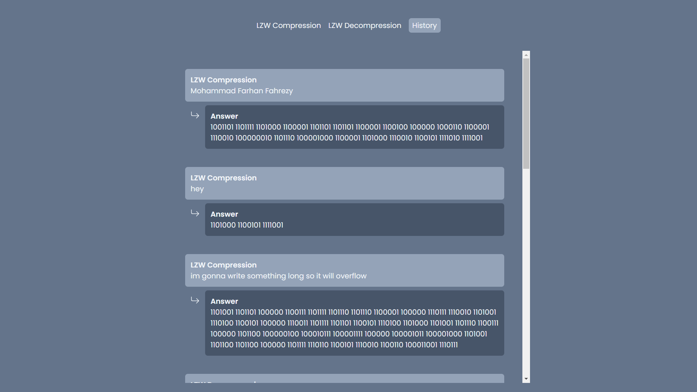

# LZW Compression Algorithm

The LZW Compression Web App is a full-stack application built using the MERN (MongoDB, Express, React, Node) stack. It provides a user-friendly interface to compress and decompress strings using the LZW algorithm.

## Table of Contents

- [Project Title](#project-title)
- [Description](#description)
- [Features](#features)
- [Installation](#installation)
- [Usage](#usage)
- [Contributing](#contributing)
- [Contact](#contact)

## Description

Let's walk through the flow of the LZW compression algorithm from the frontend to the backend, including storing the results in MongoDB and sending the response back to the frontend:

1. `Input from Frontend`: The user enters a string to be compressed or decompressed in the frontend user interface.

2. `Sending String to Backend`: The frontend sends the input string to the backend server using an HTTP POST request.

3. `LZW Compression or Decompression`: The backend receives the input string and applies the LZW compression or decompression algorithm accordingly, based on the user's request.

4. `Storing Answer in MongoDB Database`: Once the compression or decompression process is complete, the backend stores the original input string, the compressed or decompressed value, and any other relevant information in the MongoDB database.

5. `Sending Response to Frontend`: After storing the results, the backend sends a response back to the frontend. The response contains the compressed or decompressed value generated by the LZW algorithm.

## Features

- `String Compression`: Compress input strings using the LZW algorithm.
- `String Decompression`: Decompress LZW-encoded strings to recover the original data.
- `History`: Browse and review previously compressed or decompressed strings.

## Installation

To install this web app, follow the steps below:

1. Clone this repository or download it as a ZIP file.
2. Navigate to the "server" directory by running cd ./server and execute npm run devStart.
3. Go back to the main directory by running cd ../client and execute npm run dev.
4. Open https://localhost:5173/ in your web browser.

Alternatively, you can directly use this web app by visiting https://lzw-string-compression.vercel.app/.

## Usage

### String Compression

### String Decompression

### History

## Contributing

Mohammad Farhan Fahrezy

## Contact

- [Personal Website](https://farhanfahreezy.site/)
- [Linkedin](https://www.linkedin.com/in/farhanfahreezy/)
